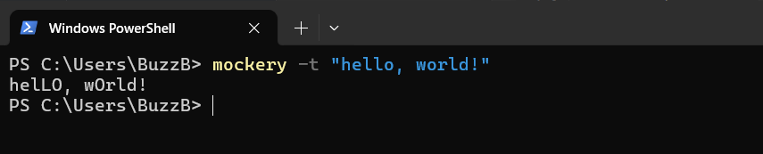

# Tired of the tedious task of inputing mockery into your comments? Do you have carpel tunnel and if not, do you want it?  

# Introducing Mockery Translator

# Usage
### Did someone correct you when you said "I use linux"?    
"Well its actually Gnu/Linux"   
```bash
mockery -m 3 -t "um, actually"
```  
"uM, ActUalLy" - 🤓  

### Were you reading a article and realized that this software isn't acutally ai powered?  
```bash
mockery -m 3 -t "its ai powered"
```  
"iTs ai pOwEred"  

# Installation
```bash
pip install mockery-translator
```


# Help
```bash
mockery -h
```
- -h: Displays this text  
- -m: mockery Level 1-6 DEFAULT=1
- -t: <inputText>; Input text to encode with mockery